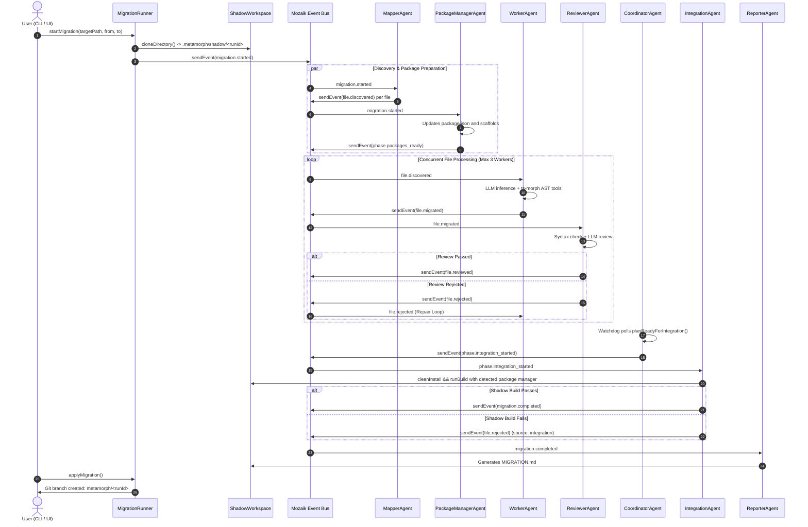

# Metamorph — Comprehensive Project Knowledge Base

## 1. Overview & Vision

**Metamorph** (`@nikelyh/metamorph`) is an enterprise-grade CLI tool and web dashboard for **automated architectural migration and codebase refactoring** powered by a **concurrent swarm of autonomous AI agents** orchestrated on the **Mozaik v4** framework.

Rather than relying on brittle regex search-and-replace or rigid AST codemods, Metamorph utilizes specialized agents that understand semantic context, analyze neighbor files, deduce actual component prop contracts, and reconcile cross-package dependencies.

### Core Invariant: Shadow Workspace (Zero-Risk Guarantee)
User source code is **never** mutated directly during active migrations:
1. **Isolation**: The target codebase is cloned into an isolated sandbox (`.metamorph/shadow/<runId>`).
2. **Safe Transformation**: Agents operate exclusively inside the Shadow Workspace.
3. **Deterministic Verification**: Real `cleanInstall` and `runBuild` commands execute inside the sandbox. If the compiler fails, the swarm autonomously diagnoses and repairs the breakage.
4. **Explicit Application**: The user inspects the output and decides whether to run `metamorph apply`, which checks out a dedicated Git branch (`metamorph/<runId>`).
5. **Zero-Trace Rollback**: Running `metamorph rollback` destroys the sandbox without touching the host repository.

---

## 2. Monorepo Architecture

Managed via **Turborepo** and **npm workspaces**:

```text
metamorph/
├── apps/
│   └── dashboard/                  # React 18/19 + Vite Web Dashboard (Feature-Sliced Design)
├── packages/
│   └── @nikelyh/
│       ├── domain/                 # Zero-I/O Core: Entities, Semantic Events, Layered Catalogs
│       ├── application/            # Mozaik Agents, Runtime, MetamorphState, MigrationRunner
│       ├── infrastructure/         # SQLite (node:sqlite), ts-morph, Shadow Workspace, Express API
│       └── cli/                    # Executable CLI (Commander, Inquirer, Ora, Chalk)
├── docs/                           # Architecture whitepapers and engineering standards
├── scratch/                        # Test playgrounds (nest-app, react-app)
└── .agents/                        # AI context rules, skills, and knowledge base
```

---

## 3. Package Breakdown & Hexagonal Layering

### 3.1. `packages/@nikelyh/domain`
Pure core with **zero I/O dependencies**. Defines business rules, contracts, and events:
* **Entities (`src/entities/`)**:
  - `MigrationProfile`: Source/target framework pair (`source`, `target`, `rules?`).
  - `MigrationPlan`: Master session state (`id`, `runId`, `profile`, `targetPath`, `tasks`, `packageManager`, `phase`, `appliedAt`).
  - `FileTask`: Per-file unit of work (`filePath`, `status`, `dependencies`, `error`).
  - `PackageManagerCommands`: Pure strategy mapping for `npm`, `pnpm`, `yarn`, and `bun`.
* **Layered Catalogs (`src/entities/catalogs/`)**:
  - Composable rule hierarchy: `ALL_MIGRATION_RULES` → `Layer` → `Runtime` → `Framework` → `Pair`.
  - `compose.ts`: `resolveMigrationCatalog(source, target)` function merging all rules deterministically.
  - `scaffolds.ts`: Target bootstrapping files (`vite.config.ts`, `next.config.mjs`, `tsconfig.json`).
* **Semantic Events (`src/events/SemanticEvents.ts`)**:
  - Typed names (`SemanticEventName`) and payloads (`SemanticEventPayloads.*`).

### 3.2. `packages/@nikelyh/application`
Orchestration layer integrating the Mozaik v4 runtime (`@mozaik-ai/core`):
* **Blackboard State (`src/runtime.ts`)**: `MetamorphState` managing journals, retry counters, and coordination locks.
* **Agent Swarm (`src/agents/`)**:
  1. `MapperAgent`: Discovers source files, initializes SQLite tasks, and emits `file.discovered`.
  2. `WorkerAgent`: Concurrency-bounded (`limit: 3`) ephemeral worker performing code transformations with catalog hints and `NeighborContext`.
  3. `ReviewerAgent`: Concurrency-bounded (`limit: 3`) ephemeral reviewer running AST syntax checks and semantic contract validations.
  4. `PackageManagerAgent`: Mutates `package.json` in memory and on disk without running host subprocesses.
  5. `CoordinatorAgent`: Watchdog polling every 8s to detect when all tasks settle before triggering shadow integration.
  6. `IntegrationAgent`: Runs clean installs and compilation builds inside the sandbox.
  7. `ReporterAgent`: Generates `MIGRATION.md` with dynamic commands.

### 3.3. `packages/@nikelyh/infrastructure`
Secondary adapter implementations:
* **Persistence (`src/db/SQLiteStateStore.ts`)**: Native Node.js `node:sqlite` (`DatabaseSync`) storing plans, tasks, and telemetry events with automatic `ALTER TABLE` schema evolution.
* **Workspace (`src/workspace/ShadowWorkspace.ts`)**: Sandboxed cloning, boundary checking (`assertSandbox`), and git integration (`MigrationIntegrator.ts`).
* **Project Intelligence Engine (`src/detector/`)**:
  - `WorkspaceResolver`: Monorepo root discovery.
  - `ManifestInspector`: Weighted dependency analysis.
  - `StructureInspector`: Physical router variant detection.
  - `SubsumptionEngine`: Directed Acyclic Graph (DAG) resolving meta-framework collisions.

### 3.4. `apps/dashboard`
React 18/19 SPA following **Feature-Sliced Design (FSD)**:
* `shared` → `entities` → `features` → `widgets` → `pages` → `app`.
* **Zero Emojis**: Employs `lucide-react` vector icons exclusively.
* **Real-Time Telemetry**: Connects to `/api/events` via Server-Sent Events (SSE).

---

## 4. Supported Migration Matrix

| Source Framework | Supported Target Frameworks |
| :--- | :--- |
| **express** | fastify, nestjs |
| **fastify** | express, nestjs |
| **nestjs** | express, fastify |
| **react** | next, vue, angular, svelte |
| **next** | react, vue, angular, svelte |
| **vue** | react, next, angular, svelte |
| **angular** | react, next, vue, svelte |
| **svelte** | react, next, vue, angular |

---

## 5. Migration Execution Lifecycle



---

## 6. Pull Request Templates Suite

Metamorph enforces standardized PR templates located in `.github/PULL_REQUEST_TEMPLATE/`:
- `feature.md`: New capabilities (PIE, polymorphic PM, CLI features).
- `bugfix.md`: Bug fixes with severity, RCA, and regression tests.
- `migration_target.md`: Framework migration pairs (`resolveMigrationCatalog`).
- `swarm_agent.md`: Mozaik v4 agents, lifecycle (`leave()`), and prompts.
- `dashboard_ui.md`: Web dashboard, FSD, zero-emoji, and Lucide icons.
- `architecture.md`: Structural refactors and SQLite auto-migrations.
- `perf_optimization.md`: Bottlenecks, profiling, and benchmark comparisons.
- `PULL_REQUEST_TEMPLATE.md`: General/default fallback.
