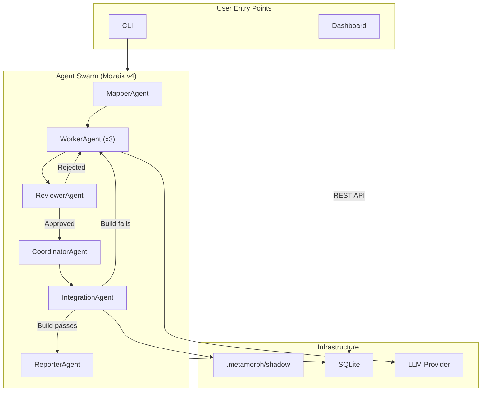

<div align="center">
  

  # 🦋 Metamorph
  **The Multi-Agent Migration CLI**

  [](https://www.npmjs.com/package/@nikelyh/metamorph)
  [](https://github.com/jigjoy-ai/mozaik)

  <p align="center">
    Refactor and migrate your entire codebase with zero risk and zero downtime.<br/>
    Powered by an elite swarm of autonomous agents.<br/><br/>
    <b><a href="https://metamorph.nikelyh.tech/docs">Read the Full Documentation</a></b> |
    <b><a href="./docs/architecture.md">System Architecture</a></b>
  </p>

  <p align="center">
    
    
    
    
    
    
  </p>
</div>

---

## Overview

**Metamorph** is an advanced CLI tool designed to completely automate complex architectural shifts and framework migrations. Instead of relying on regular expressions or manual AST transformations, Metamorph orchestrates a swarm of specialized Agents (Mapper, Worker, Reviewer, and PackageManager) to semantically rewrite your code.

- **Project Intelligence Engine (PIE)**: Autonomously maps complex codebases, heuristics, and monorepos (Turborepo, pnpm workspaces, npm/yarn workspaces, Lerna).
- **Polymorphic Package Manager Engine (PPME)**: Native, lockfile-aware execution adapting cleanly to `npm`, `pnpm`, `yarn`, and `bun`.
- **Zero Risk (Shadow Workspace)**: All file mutations and builds occur inside an isolated sandbox (`.metamorph/shadow/<runId>`). Your original code is never touched until you review and apply.
- **Shadow Verification Build**: Migrations are strictly compiled and verified before completion.
- **Real-Time Visual Telemetry**: Monitor swarm operations, review feedback, and build diagnostics in real-time via the built-in React dashboard.

## System Architecture

Metamorph follows a strict hexagonal architecture with an event-driven agent swarm. For complete architectural whitepapers, see:

- **[System Architecture Overview](./docs/architecture.md)**
- **[01. Project Intelligence Engine (PIE)](./docs/architecture/01-project-intelligence-engine.md)**
- **[02. Polymorphic Package Manager Engine (PPME)](./docs/architecture/02-package-manager-engine.md)**
- **[03. Mozaik v4 Swarm Orchestration](./docs/architecture/03-mozaik-swarm-orchestration.md)**
- **[04. Shadow Workspace Isolation](./docs/architecture/04-shadow-workspace-isolation.md)**
- **[05. Layered Migration Catalogs](./docs/architecture/05-layered-migration-catalogs.md)**
- **[06. Dashboard FSD & Telemetry](./docs/architecture/06-dashboard-fsd-telemetry.md)**



### Monorepo Structure

Built as a scalable monorepo using [Turborepo](https://turbo.build/):

| Package | Layer | Responsibility |
|---|---|---|
| `packages/@nikelyh/domain` | Domain | Entities, events, ports (zero I/O) |
| `packages/@nikelyh/application` | Application | Agent definitions, migration orchestration |
| `packages/@nikelyh/infrastructure` | Infrastructure | SQLite, file system, Express API, ts-morph |
| `packages/@nikelyh/cli` | Driving Adapter | Commander-based CLI entry point |
| `apps/dashboard` | Driving Adapter | React 18 real-time monitoring UI |

## Usage

If you just want to use Metamorph to migrate a project, simply install it globally via NPM:

```bash
npm install -g @nikelyh/metamorph
```

And run it inside any project directory:

```bash
metamorph run
```

To monitor the agents in real-time, open a new terminal in the same folder and run:
```bash
metamorph ui
```

### Other Commands
 
- `metamorph run [options]`: Runs an automated migration (e.g. `--from <src> --to <target> --workspace <pkg>`).
- `metamorph detect [path]`: Detects frameworks, libraries, package managers, and monorepo workspaces.
- `metamorph apply <runId> [targetPath]`: Applies a completed migration to your repository, creating a new git branch.
- `metamorph rollback <runId>`: Discards an unapplied migration and cleans up the shadow workspace.
- `metamorph list`: Lists all migration history.
- `metamorph reset`: Clears all migration history and events from the local database.

## Supported Migrations

The list of supported architectural shifts is updated frequently as new migration catalogs are added.

See the complete, up-to-date list of all supported frontend and backend framework migrations in the official documentation:

**[View Supported Migrations](https://metamorph.nikelyh.tech/docs/migrations)**

## Local Development

Want to contribute or modify Metamorph? Follow these steps to run the monorepo locally.

### Prerequisites
- Node.js >= 20
- npm >= 10.8

### Setup

1. **Clone the repository:**
   ```bash
   git clone https://github.com/yohanvillarp/metamorph.git
   cd metamorph
   ```

2. **Install dependencies:**
   ```bash
   npm install
   ```

3. **Set up Environment Variables:**
   Create a `.env` file in the root directory and add your provider keys (e.g., OpenAI, Anthropic) as required by Mozaik.
   ```env
   OPENAI_API_KEY=sk-...
   ```

4. **Run the build pipeline:**
   ```bash
   npm run build
   ```

### Running Locally

To test the CLI from source without installing it globally, you can use the Turborepo dev script:

```bash
npm run dev
```
*(Alternatively, navigate to `packages/@nikelyh/cli` and run `npm run dev`)*.

## Contributing

We welcome contributions! If you'd like to add support for a new framework migration (e.g., SvelteKit to Nuxt, Python Django to FastAPI), please open an issue first to discuss the architecture.

1. Fork the Project
2. Create your Feature Branch (`git checkout -b feature/AmazingFeature`)
3. Commit your Changes (`npm run changeset`)
4. Push to the Branch (`git push origin feature/AmazingFeature`)
5. Open a Pull Request

---
<div align="center">
  <i>Built with Mozaik 💖</i>
</div>
