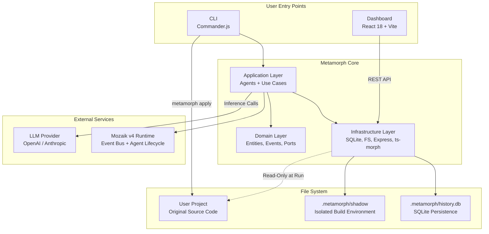
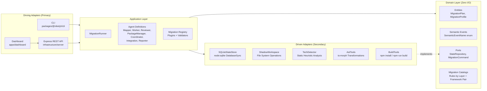
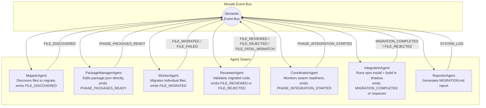
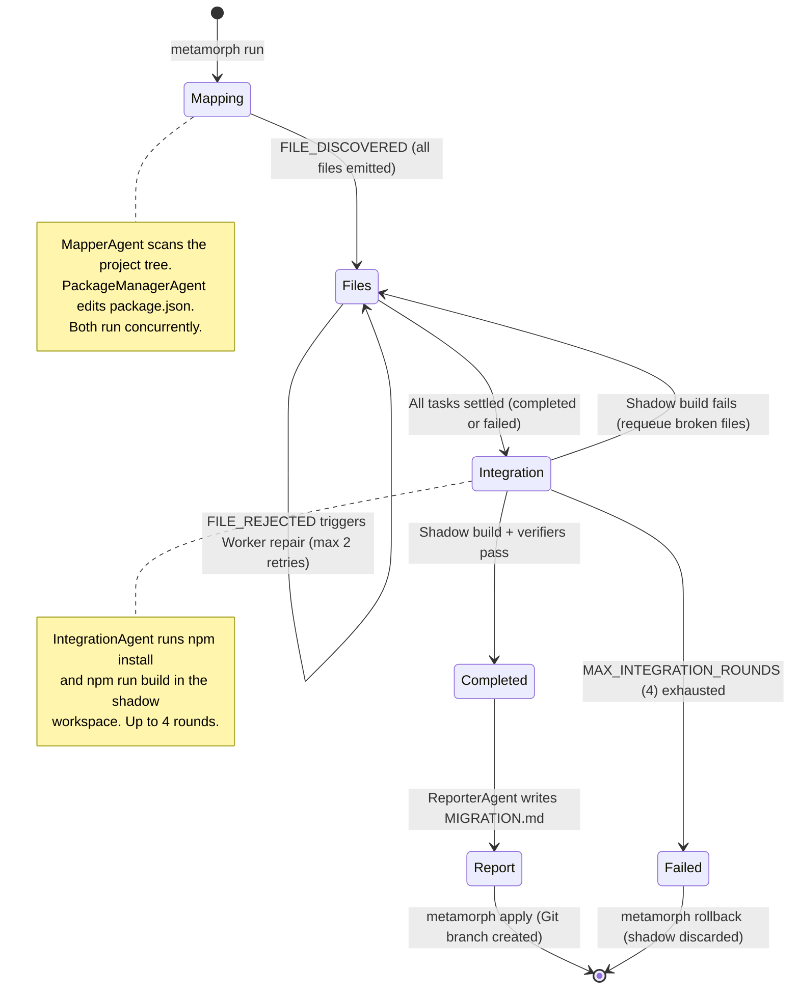
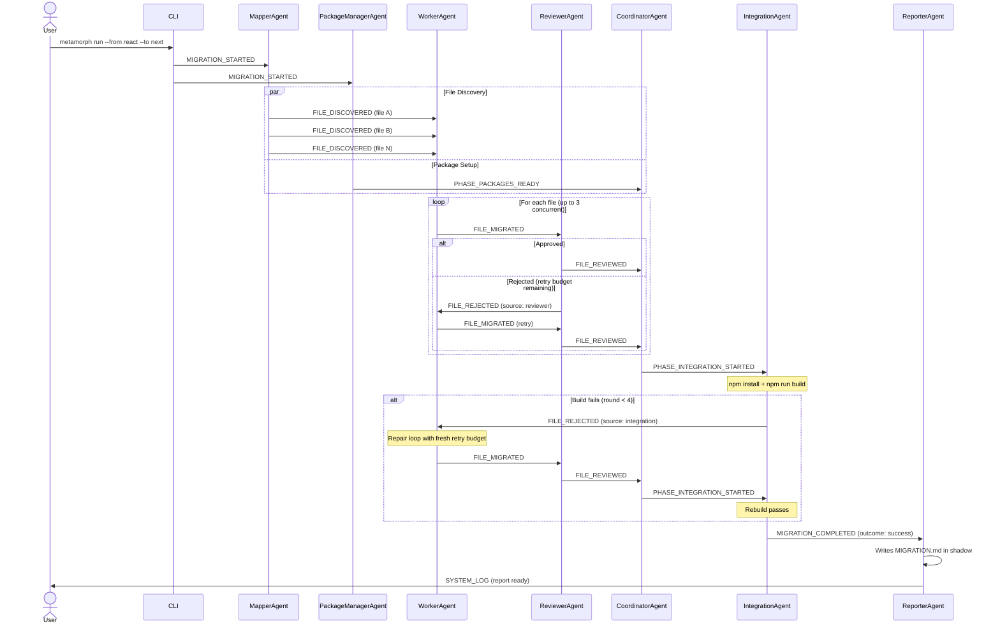
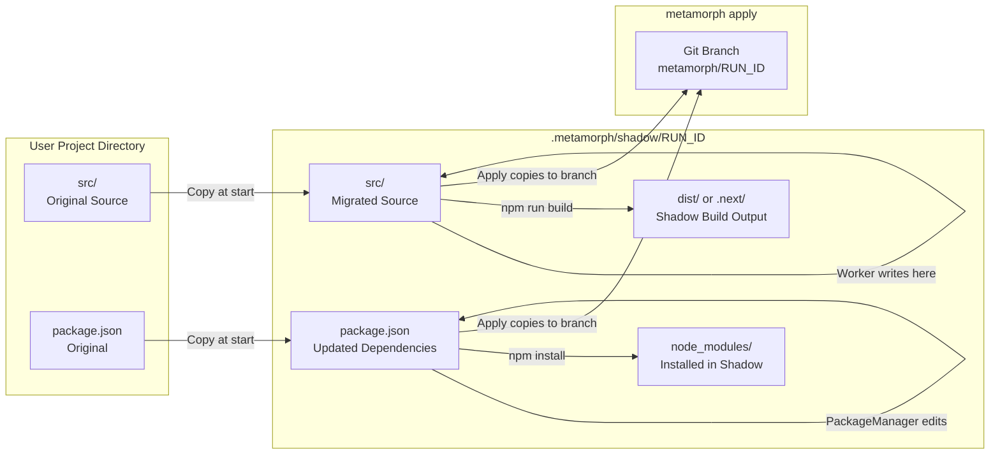
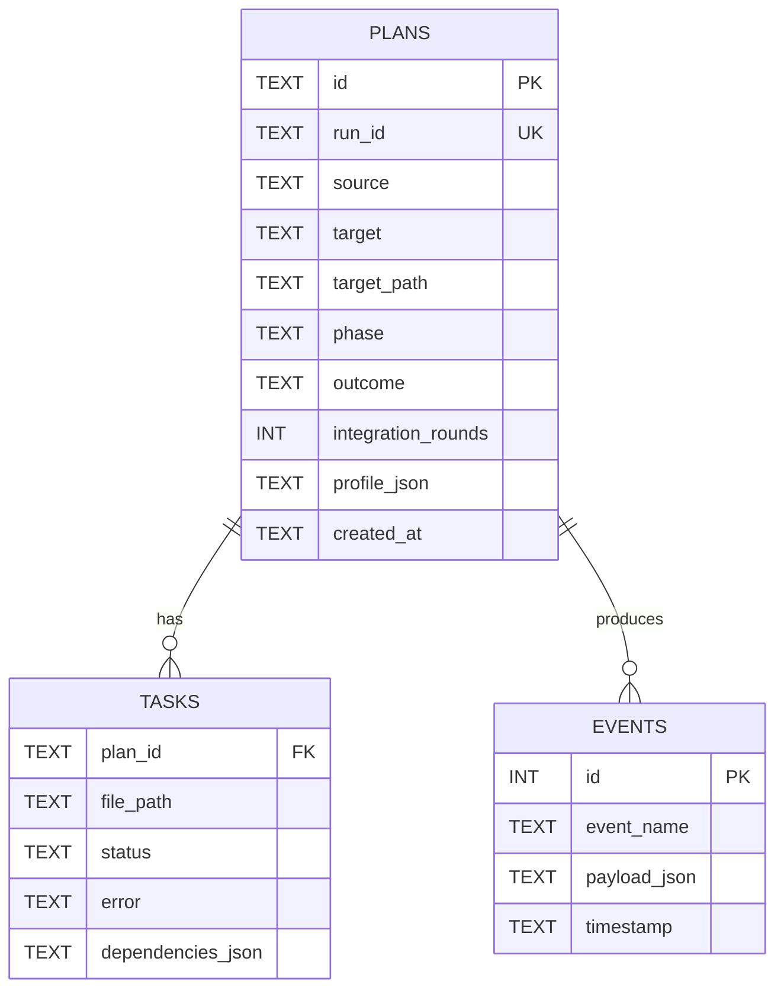
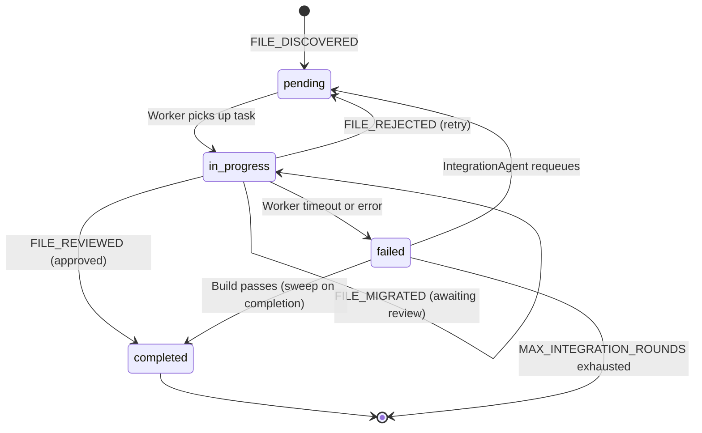

# Metamorph System Architecture

This document describes the internal architecture of Metamorph, including its hexagonal layer decomposition, the agent swarm lifecycle, the event-driven communication model, and the shadow workspace pipeline.

All diagrams use [Mermaid](https://mermaid.js.org/) syntax and render natively on GitHub.

---

## 1. High-Level System Overview

The following diagram shows the relationship between the user-facing entry points (CLI and Dashboard), the internal processing pipeline, and the external dependencies.



---

## 2. Hexagonal Architecture

Metamorph follows a strict hexagonal (ports and adapters) architecture. The domain layer has zero I/O dependencies. Application logic depends only on abstract ports defined in the domain. Infrastructure provides the concrete adapters.



### Layer Rules

| Layer | Package | Allowed Dependencies |
|---|---|---|
| Domain | `@nikelyh/domain` | None (zero I/O, zero external imports) |
| Application | `@nikelyh/application` | Domain |
| Infrastructure | `@nikelyh/infrastructure` | Domain, Application (port implementations only) |
| CLI | `@nikelyh/cli` | Application, Infrastructure |
| Dashboard | `apps/dashboard` | Infrastructure REST API (HTTP only) |

---

## 3. Agent Swarm Architecture

Metamorph orchestrates six specialized agents through the Mozaik v4 runtime. Agents communicate exclusively via semantic events on the bus; they never invoke each other directly.



### Agent Responsibilities

| Agent | Trigger Event | Output Events | Concurrency |
|---|---|---|---|
| **MapperAgent** | `MIGRATION_STARTED` | `FILE_DISCOVERED` (one per file) | 1 instance |
| **PackageManagerAgent** | `MIGRATION_STARTED` | `PHASE_PACKAGES_READY` | 1 instance |
| **WorkerAgent** | `FILE_DISCOVERED`, `FILE_REJECTED` | `FILE_MIGRATED`, `FILE_FAILED` | Up to 3 concurrent (ConcurrencyQueue) |
| **ReviewerAgent** | `FILE_MIGRATED` | `FILE_REVIEWED`, `FILE_REJECTED`, `FILE_FATAL_MISMATCH` | 1 per file |
| **CoordinatorAgent** | `FILE_REVIEWED`, `FILE_FAILED`, `FILE_FATAL_MISMATCH`, `PHASE_PACKAGES_READY` | `PHASE_INTEGRATION_STARTED` | 1 instance (no LLM calls) |
| **IntegrationAgent** | `PHASE_INTEGRATION_STARTED` | `MIGRATION_COMPLETED`, `FILE_REJECTED` (source: integration) | 1 instance (locked per plan) |
| **ReporterAgent** | `MIGRATION_COMPLETED` | `SYSTEM_LOG` | 1 instance |

---

## 4. Migration Lifecycle

The complete lifecycle of a migration run, from CLI invocation to final application.



### Phase Transitions

| Phase | Description | Next Phase |
|---|---|---|
| `mapping` | File discovery and dependency analysis | `files` |
| `files` | Concurrent file migration and review | `integration` |
| `integration` | Shadow workspace build and verification | `completed`, `failed`, or back to `files` |
| `completed` | Build passed, report generated | Terminal (awaiting `apply`) |
| `failed` | Build budget exhausted or unrecoverable error | Terminal (awaiting `rollback`) |

---

## 5. Event Flow Sequence

Detailed sequence of events during a successful migration with one integration repair round.



---

## 6. Shadow Workspace Pipeline

The shadow workspace guarantees zero-risk execution. The user's source code is never modified during a migration run.



### Safety Invariants

1. **Read-only access to user project during `run`** -- Agents read the original source for context but write exclusively to the shadow directory.
2. **No global side effects** -- `npm install` and `npm run build` execute only inside `.metamorph/shadow/<runId>`. The `PackageManagerAgent` edits the shadow `package.json` directly via JSON manipulation; it never runs `npm install` in the user directory.
3. **Atomic application** -- `metamorph apply` copies the shadow result into a dedicated Git branch (`metamorph/<runId>`). The user's working tree is not modified until they merge the branch.
4. **Clean rollback** -- `metamorph rollback` deletes the shadow directory and its database records. No trace remains.

---

## 7. Data Persistence Model



### Task Status Machine



---

## 8. Concurrency and Rate Limiting

| Mechanism | Location | Limit | Purpose |
|---|---|---|---|
| `ConcurrencyQueue` | WorkerAgent | 3 concurrent tasks | Prevent LLM API rate-limit exhaustion |
| `integrationLocks` | IntegrationAgent | 1 per plan | Prevent duplicate build rounds |
| `retryCounts` | WorkerAgent | 2 retries per file | Prevent infinite reject-repair loops |
| `integrationRounds` | IntegrationAgent | 4 rounds per plan | Cap total shadow build attempts |
| Watchdog timer | CoordinatorAgent | 30 min absolute | Terminate stalled migrations |
| Worker timeout | WorkerAgent | 120s per inference | Prevent single-file deadlocks |
| Repair timeout | IntegrationAgent | 120s per repair loop | Prevent integration repair hangs |

---

## 9. Directory Structure Reference

```text
metamorph/
    apps/
        dashboard/                  React 18 + Vite (Feature-Sliced Design)
            src/
                app/                Global setup, providers, router
                pages/              Route-level page components
                widgets/            Overview, SwarmView, Queue, EventLog
                entities/           UI-specific domain types
                shared/             UI kit, API client, hooks
    packages/
        @nikelyh/
            domain/                 Zero-I/O core
                src/
                    entities/       MigrationPlan, MigrationProfile, catalogs/
                    events/         SemanticEventName enum + typed payloads
                    ports/          StateRepository (secondary port)
                    driving/        MigrationCommand (primary port)
            application/            Agents and orchestration logic
                src/
                    agents/         Mapper, Worker, Reviewer, PackageManager,
                                    Coordinator, Integration, Reporter
                    migration/      Plugins, validators, registry
                    utils/          FileTreeBuilder, NeighborContext, NextMigrationHints
            infrastructure/         Concrete adapters
                src/
                    db/             SQLiteStateStore (node:sqlite)
                    workspace/      ShadowWorkspace, MigrationIntegrator
                    detector/       TechDetector (static heuristics)
                    tools/          AstTools (ts-morph), BuildTools, LinterTools
                    server/         Express REST API for Dashboard
            cli/                    Commander-based CLI entry point
    docs/
        architecture.md             This document
        mozaik/                     Local copy of Mozaik v4 documentation
```
