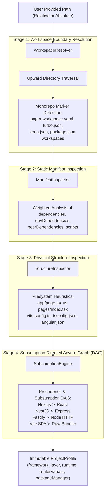
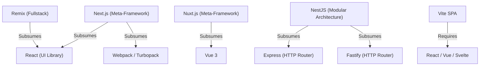

# Project Intelligence Engine (PIE) — Architecture & Heuristics

The **Project Intelligence Engine (PIE)** is Metamorph's static analysis and architectural classification subsystem. Its objective is to inspect any codebase—ranging from simple single-page applications (SPAs) to polyglot enterprise monorepos—and mathematically deduce its underlying framework, runtime layer, routing paradigm, and package manager, all while consuming **zero LLM tokens**.

---

## 1. The Shortcomings of Conventional Detection

Traditional migration tools rely on naive single-file inspection, typically reading only the root `package.json`:
- **Meta-Framework Collision**: If a project contains `react`, `react-dom`, and `next` in its manifest, naive detectors misclassify the project as a legacy React SPA rather than a Next.js fullstack application.
- **Monorepos & Nested Workspaces**: When pointing a CLI at a subpackage inside a monorepo (`packages/web-app`), standard detectors fail to traverse upwards to detect workspace roots, shared dependency manifests, or hoisted lockfiles.
- **Routing Paradigm Ambiguity**: React Router v6, Next.js Pages Router, and Next.js App Router require vastly different transformation rules. Manifest-only inspection cannot distinguish between the presence of `src/pages` and `src/app`.
- **Shared Bundler Clashing**: The presence of `vite.config.ts` does not guarantee a project is pure React; it could be Vue 3, SvelteKit, or an internal library.

---

## 2. Detection Pipeline Topology

PIE executes a deterministic 4-stage sequential pipeline:



---

## 3. Core Engine Components

### 3.1. `WorkspaceResolver` (`packages/@nikelyh/infrastructure/src/detector/WorkspaceResolver.ts`)
Executes parent directory traversal to discover root workspace boundaries and package manager lockfiles:
- **Supported Monorepo Markers**:
  - `pnpm-workspace.yaml` (pnpm workspaces)
  - `turbo.json` (Turborepo)
  - `lerna.json` (Lerna)
  - `package.json` with `"workspaces": [...]` array (npm/yarn workspaces)
- **Subpackage Discovery**: When executed on a monorepo root, PIE recursively discovers all member packages and scores their individual frameworks, enabling interactive package selection in the CLI and Dashboard.

### 3.2. `ManifestInspector` (`packages/@nikelyh/infrastructure/src/detector/ManifestInspector.ts`)
Parses the nearest manifest as well as the hoisted root manifest:
- **Dependency Weighting**: Production dependencies (`dependencies`) yield a confidence factor of `1.0`. Development dependencies (`devDependencies`) or build scripts contribute a `0.6` factor for tooling markers.
- **Package Manager Identification**: Detects whether the codebase utilizes `pnpm`, `yarn`, `bun`, or `npm` by checking lockfiles (`pnpm-lock.yaml`, `yarn.lock`, `bun.lockb`, `package-lock.json`) and Corepack `packageManager` declarations.

### 3.3. `StructureInspector` (`packages/@nikelyh/infrastructure/src/detector/StructureInspector.ts`)
Inspects the physical filesystem layout:
- **Router Variant Detection**:
  - `next-app-router`: Presence of `app/**/page.{tsx,jsx,js}` or `src/app/**/page.{tsx,jsx,js}`.
  - `next-pages-router`: Presence of `pages/**/*.{tsx,jsx,js}` or `src/pages/**/*.{tsx,jsx,js}`.
  - `react-spa`: Presence of `src/App.{tsx,jsx}`, `index.html`, and absence of server route trees.
- **Layout Preservation & Collision Guards**: Detects invalid layout collisions, such as legacy `src/pages` folders left inside App Router targets.

### 3.4. `SubsumptionEngine` (`packages/@nikelyh/infrastructure/src/detector/SubsumptionEngine.ts`)
Resolves collisions where a meta-framework inherently includes lower-level base libraries. Uses a **Directed Acyclic Graph (DAG)** of precedence relationships:



When scoring both `next` and `react`, the rule `next ≻ react` in the subsumption DAG clears the base React classification in favor of Next.js, deterministically outputting:
```typescript
{
  framework: "next",
  layer: "frontend",
  runtime: "next-app",
  routerVariant: "app-router",
  packageManager: "pnpm"
}
```

---

## 4. Invariants & Guarantees

1. **Zero LLM Tokens**: 100% of detection relies on deterministic heuristics and AST layout checks. No AI token costs or network dependencies.
2. **Sub-millisecond Latency**: Designed to resolve in under `5ms` on standard repos and under `20ms` on enterprise monorepos containing 50+ packages.
3. **Hexagonal Immutability**: Emits an immutable `ProjectProfile` contract defined in `@nikelyh/domain`, ensuring zero leakage of infrastructure details into application logic.
