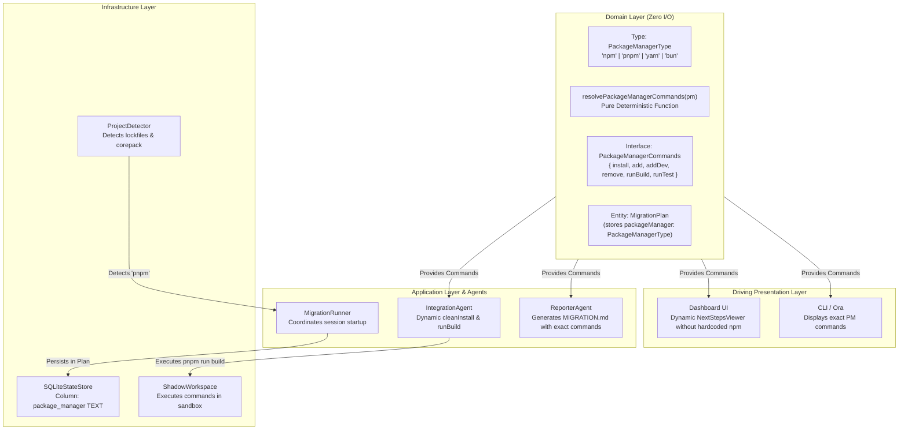

# Polymorphic Package Manager Engine (PPME) — Architecture & Strategy

The **Polymorphic Package Manager Engine (PPME)** is Metamorph's subsystem responsible for cross-ecosystem package manager compatibility (`npm`, `pnpm`, `yarn`, `bun`). It completely eliminates hardcoded command execution, ensures sandboxed installs, and preserves project lockfile integrity.

---

## 1. The Challenges of Modern Package Management

Modern TypeScript and JavaScript projects utilize divergent package managers with notable differences:
- **Command Syntax Discrepancies**:
  - Dependency installation: `npm install` vs `pnpm install` vs `yarn` vs `bun install`.
  - Adding a package: `npm install <pkg>` vs `pnpm add <pkg>` vs `yarn add <pkg>` vs `bun add <pkg>`.
  - Executing scripts: `npm run build` vs `pnpm run build` vs `yarn build` vs `bun run build`.
- **Node Modules Structure & Symlink Isolation**: `pnpm` employs content-addressable storage with strict symlinks. Accidentally running `npm install` inside a `pnpm` project creates orphan `package-lock.json` files, corrupts symlinks, and invalidates build caches.
- **Monorepo Pollution**: Uncontrolled package manager commands can traverse upward into the host monorepo, mutating dependencies in unaffected packages before the user explicitly runs `metamorph apply`.

---

## 2. Hexagonal Topology of the Engine

Polymorphic package management follows the Strategy Pattern within Metamorph's hexagonal architecture:



---

## 3. Component Breakdown

### 3.1. Pure Functional Abstraction (`packages/@nikelyh/domain/src/entities/PackageManagerCommands.ts`)
Defines the side-effect-free, Zero-I/O mapping contract:

```typescript
export type PackageManagerType = 'npm' | 'pnpm' | 'yarn' | 'bun';

export interface PackageManagerCommands {
  install: string;
  add: (pkg: string) => string;
  addDev: (pkg: string) => string;
  remove: (pkg: string) => string;
  runBuild: string;
  runTest: string;
  cleanInstall: string;
}

export function resolvePackageManagerCommands(pm?: PackageManagerType): PackageManagerCommands {
  const selected = pm ?? 'npm';
  switch (selected) {
    case 'pnpm':
      return {
        install: 'pnpm install',
        add: (pkg) => `pnpm add ${pkg}`,
        addDev: (pkg) => `pnpm add -D ${pkg}`,
        remove: (pkg) => `pnpm remove ${pkg}`,
        runBuild: 'pnpm run build',
        runTest: 'pnpm test',
        cleanInstall: 'pnpm install --frozen-lockfile'
      };
    case 'yarn':
      return {
        install: 'yarn',
        add: (pkg) => `yarn add ${pkg}`,
        addDev: (pkg) => `yarn add -D ${pkg}`,
        remove: (pkg) => `yarn remove ${pkg}`,
        runBuild: 'yarn build',
        runTest: 'yarn test',
        cleanInstall: 'yarn --frozen-lockfile'
      };
    case 'bun':
      return {
        install: 'bun install',
        add: (pkg) => `bun add ${pkg}`,
        addDev: (pkg) => `bun add -d ${pkg}`,
        remove: (pkg) => `bun remove ${pkg}`,
        runBuild: 'bun run build',
        runTest: 'bun test',
        cleanInstall: 'bun install --frozen-lockfile'
      };
    case 'npm':
    default:
      return {
        install: 'npm install',
        add: (pkg) => `npm install ${pkg}`,
        addDev: (pkg) => `npm install -D ${pkg}`,
        remove: (pkg) => `npm uninstall ${pkg}`,
        runBuild: 'npm run build',
        runTest: 'npm test',
        cleanInstall: 'npm ci'
      };
  }
}
```

### 3.2. Idempotent SQLite Auto-Migration (`packages/@nikelyh/infrastructure/src/db/SQLiteStateStore.ts`)
To maintain backwards compatibility with existing `.metamorph/history.db` databases, the `plans` table runs non-destructive schema evolution:

```sql
ALTER TABLE plans ADD COLUMN package_manager TEXT DEFAULT 'npm';
```

Executed within safe try/catch error guards upon `SQLiteStateStore` initialization, ensuring zero migration script overhead while protecting existing user databases.

### 3.3. Isolated Shadow Workspace Execution (`IntegrationAgent.ts`)
During shadow verification, `IntegrationAgent` adapts dynamically:
1. Retrieves the active plan's package manager (`plan.packageManager`).
2. Obtains corresponding commands via `resolvePackageManagerCommands(plan.packageManager)`.
3. Invokes dependency installation and project compilation inside `.metamorph/shadow/<runId>` using the appropriate binary.
4. Captures compiler diagnostic outputs specific to the active package manager.

### 3.4. Dynamic UI & Report Rendering
- **`NextStepsViewer.tsx`**: Renders verified next-step commands in `apps/dashboard` tailored to the detected package manager.
- **`ReporterAgent.ts`**: Populates `MIGRATION.md` with verified execution snippets matching the project's native toolchain.

---

## 4. Architectural Invariants

1. **Zero Workspace Leaks**: All installations remain strictly confined to the shadow sandbox.
2. **Missing Binary Graceful Degradation**: If a detected manager (e.g. `bun`) is absent from the host machine, the engine reports actionable remediation steps without crashing.
3. **Historical Compatibility**: Past migration plans loaded from SQLite seamlessly fall back to `'npm'`.
