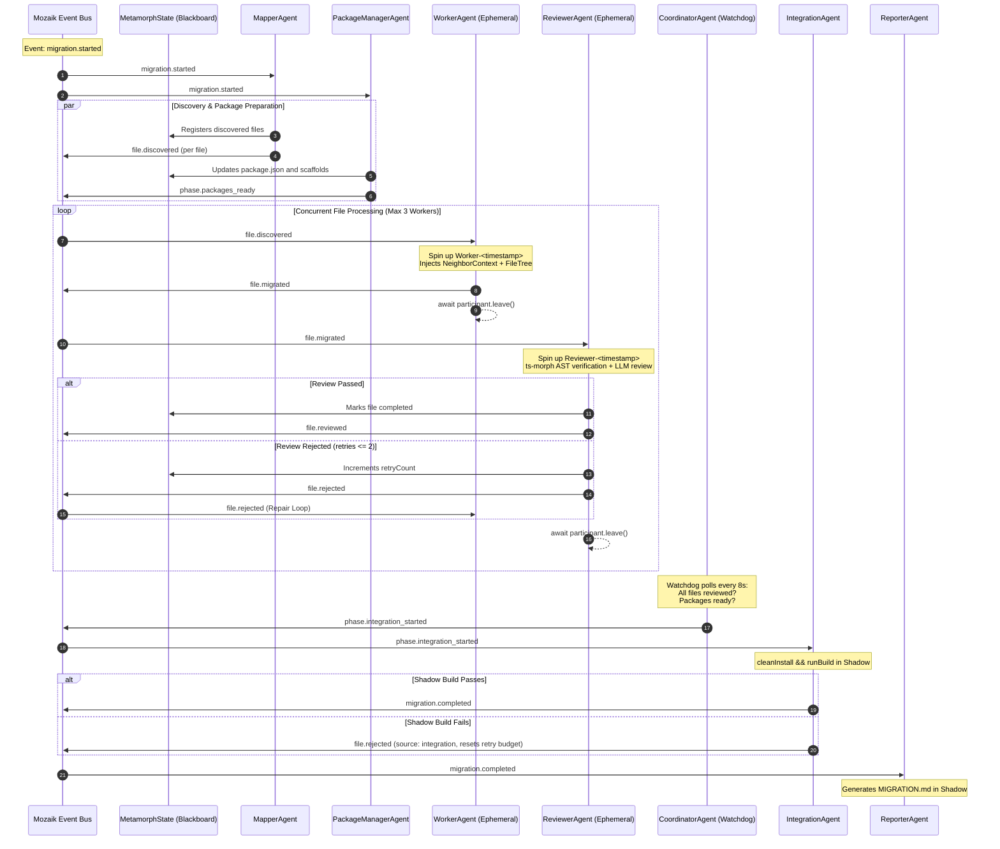

# Mozaik v4 Concurrent Swarm Engine — Architecture & Orchestration

The **Mozaik v4 Concurrent Swarm Engine** is Metamorph's agentic core. Built on top of **Mozaik v4** (`@mozaik-ai/core`), Metamorph decomposes code refactoring into an event-driven choreography of autonomous, specialized AI agents coordinated through a blackboard architecture.

---

## 1. The Pitfalls of Linear AI Pipelines

Standard AI-assisted migration tools attempt code migration through sequential workflows or single monolithic prompts:
- **Context Window Saturation**: Processing an entire project in a single prompt exhausts context limits, degrades code generation quality, and causes massive token overhead.
- **Cascading Failures**: When a single file fails in a rigid pipeline, the entire migration aborts or enters an inconsistent state.
- **Lack of Domain Specialization**: A single prompt cannot simultaneously handle package manifests, TypeScript syntax updates, AST transformations, and compilation checks without frequent hallucinations.

---

## 2. Event-Driven & Blackboard Paradigm

In Metamorph, **agents do not call each other directly**. Agents subscribe to semantic events on the Mozaik bus via `SituationSpecification` and mutate shared blackboard state:



---

## 3. Swarm Agent Directory

| Agent | Lifespan | Concurrency | Core Responsibility |
| :--- | :--- | :--- | :--- |
| **`MapperAgent`** | Daemon (Fixed) | 1 | Discovers files while filtering build artifacts; initializes SQLite file tasks and publishes `file.discovered`. |
| **`PackageManagerAgent`** | Daemon (Fixed) | 1 | Mutates manifest and config files on disk. Executes zero subcommands to avoid workspace pollution. |
| **`WorkerAgent`** | Ephemeral | Bounded (3) | Spawns temporary `Worker-<ts>` agents to perform code transforms using catalog hints, `NeighborContext`, and project trees. |
| **`ReviewerAgent`** | Ephemeral | Bounded (3) | Spawns temporary `Reviewer-<ts>` agents. Verifies AST syntax with `ts-morph` and validates public contracts against neighboring files. |
| **`CoordinatorAgent`** | Watchdog (Fixed) | 1 | Polls the blackboard state. Triggers shadow integration once all files settle and dependencies are configured. |
| **`IntegrationAgent`** | Daemon (Fixed) | 1 | Orchestrates clean installs and builds in the shadow workspace. Diagnoses compilation failures and reopens broken files. |
| **`ReporterAgent`** | Daemon (Fixed) | 1 | Compiles final `MIGRATION.md` detailing migration deltas, transformed modules, and CLI execution guidance. |

---

## 4. Concurrency & Memory Management

### 4.1. Ephemeral Participant Lifecycle (`leave()`)
Long-running agent systems suffer from memory leaks if dynamic participants linger. Metamorph guarantees deterministic participant disposal:

```typescript
// Ephemeral Worker pattern in WorkerAgent.ts:
const participant = await runtime.createParticipant(`Worker-${Date.now()}`);
try {
  await transformFileWithLLM(participant, taskContext);
} finally {
  // Deterministic resource cleanup in Mozaik v4
  await participant.leave();
}
```

### 4.2. Rate Limiting via `ConcurrencyQueue`
To prevent rate-limit saturation (HTTP 429) and control memory footprint, all LLM-calling agents execute through a bounded concurrency queue (`limit: 3`).

### 4.3. Retry Budget & Integration Circuit Breaker
- **Standard Review Rejections**: Files rejected by `ReviewerAgent` receive up to 2 retry attempts (`MAX_RETRIES = 2`). Exceeding this limit marks the task as `file.failed` to unblock the swarm.
- **Integration Resets**: If a rejection originates from `IntegrationAgent` (shadow build failure), the retry counter is reset (`retryCount = 0`), enabling collective build repair.

---

## 5. Architectural Guarantees

1. **Fire-and-Forget Communication**: Agents never block the Node.js event loop waiting for synchronous responses.
2. **Watchdog Determinism**: The coordinator ensures no files remain in `pending` or `in_progress` before initiating shadow builds.
3. **Persisted Telemetry**: All bus events are written asynchronously to the `events` table in SQLite (`history.db`) to drive the Web Dashboard live log.
