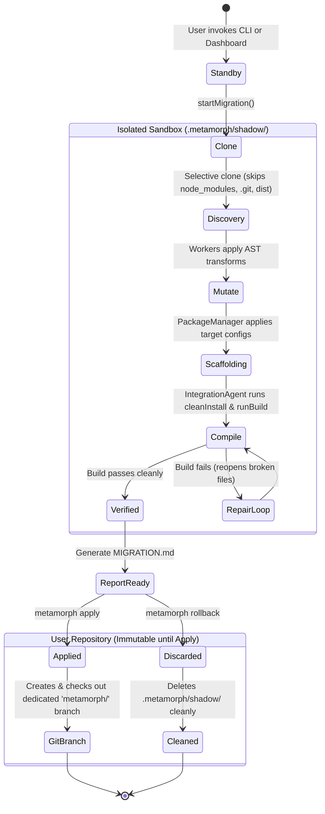

# Shadow Workspace & Zero-Risk Isolation Engine — Sandboxing Architecture

The **Shadow Workspace** is Metamorph's core resilience and security foundation. Its purpose is to fulfill the system's **Zero-Risk Invariant**: under no circumstances is a user's original codebase destructively mutated or exposed to unstable test builds during a migration.

---

## 1. Safety Concerns in Automated Code Refactoring

Tools that modify production code in place create critical risks:
- **Irreversible Codebase Corruption**: When a codemod or AI agent encounters an unexpected exception mid-migration, the repository is left in a broken, half-migrated state.
- **Environment Contamination**: Running `npm install` or build commands directly in the working directory overwrites local developer configurations, invalidates lockfiles, and pollutes shared workspace symlinks.
- **Blind Merging**: Developers have no way of verifying whether the migrated project compiles cleanly before committing to the changes.

---

## 2. Shadow Workspace Lifecycle

Metamorph isolates all file transformations and test executions within `.metamorph/shadow/<runId>`:



---

## 3. Sandboxing & Security Safeguards

### 3.1. Selective High-Speed Cloning (`ShadowWorkspace.ts`)
Upon migration initialization:
1. A cryptographically unique session identifier (`runId`) is created.
2. The hermetic sandbox `.metamorph/shadow/<runId>` is generated.
3. Source files are copied while strictly ignoring heavy or non-source directories (`node_modules`, `.git`, `.next`, `dist`, `build`, `.turbo`, `.metamorph`).
4. The clone completes in milliseconds via native filesystem stream pipelines.

### 3.2. Boundary Enforcement (`assertSandbox`)
All filesystem adapters and AST tools (`ts-morph`) enforce path verification against sandbox escape vulnerabilities:

```typescript
export function assertSandbox(filePath: string, shadowDir: string): void {
  const normalizedTarget = path.resolve(filePath);
  const normalizedShadow = path.resolve(shadowDir);
  
  if (!normalizedTarget.startsWith(normalizedShadow)) {
    throw new SecurityException(
      `Sandbox Boundary Violation: Attempted file mutation outside Shadow Workspace at: ${filePath}`
    );
  }
}
```

### 3.3. Safe AST Transformations (`ts-morph`) & Neighbor Context
For complex transforms (updating imports, migrating routing hooks, adjusting component signatures), Metamorph uses `AstTools`:
- **Syntax Tree Preservation**: Maintains comments, formatting, and exported interface signatures.
- **Neighbor Context**: When transforming a file (e.g. `Button.tsx`), the system inspects neighboring files in the shadow workspace that import it, guaranteeing public prop names (`onClick`, `variant`, etc.) remain identical across consumers.

---

## 4. Atomic Apply & Zero-Trace Rollback

### 4.1. Explicit Apply (`metamorph apply`)
Transferring transformed code back to the user's repository occurs strictly with explicit user consent:
1. Verifies in SQLite (`history.db`) that the shadow workspace achieved a successful integration build.
2. Creates a dedicated Git branch in the user repository (`metamorph/<runId>`).
3. Syncs the verified files from `.metamorph/shadow/<runId>` into the project root.
4. Generates an initial commit on the new branch, leaving previous Git history undisturbed.

### 4.2. Instant Rollback (`metamorph rollback`)
If the user chooses to abandon the migration:
1. `metamorph rollback <runId>` deletes `.metamorph/shadow/<runId>`.
2. The user's active working tree remains completely untouched.

---

## 5. Invariants & Guarantees

1. **Host Immutability**: No original user files are modified during inference or compilation.
2. **Subprocess Confinement**: Child process working directories (`cwd`) are forced into `.metamorph/shadow/<runId>`.
3. **Auditability**: All modified files, diffs, and compile outputs are recorded in `.metamorph/history.db`.
