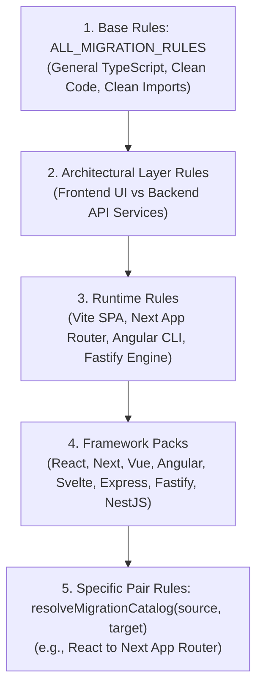

# Layered Migration Catalogs & Verification Engine — Architecture

The **Layered Migration Catalog Engine** is Metamorph's declarative knowledge and rule resolution subsystem. It defines how framework transformation rules, code scaffolds, anti-patterns, and structural verifiers are composed hierarchically to guide AI workers and validate output deterministically.

---

## 1. Declarative Composable Rules vs Hardcoded Prompts

Traditional AI refactoring tools embed prompt strings directly inside agent logic, leading to:
- **Tight Coupling**: Adding a new migration target requires modifying agent runners.
- **Rule Redundancy**: General frontend migration rules (e.g. styling, TypeScript setup) are duplicated across React, Vue, and Angular prompts.
- **Absence of Deterministic Verification**: When an LLM generates invalid routing directories, traditional tools only catch the error after hours of build debugging.

---

## 2. Layered Catalog Composition Hierarchy

Metamorph composes migration rules through a 5-layer hierarchy:

### The `resolveMigrationCatalog` Resolver
Located in `packages/@nikelyh/domain/src/entities/catalogs/compose.ts`, the resolver merges rule sections into a unified `MigrationCatalogEntry`:
- **Scaffolds**: Base configuration files required by the target (`next.config.mjs`, `vite.config.ts`, `tsconfig.json`).
- **Dependencies Delta**: Explicit lists of `dependenciesToAdd`, `dependenciesToRemove`, `devDependenciesToAdd`, `devDependenciesToRemove`.
- **Architectural Rules & Before/After Code Snippets**: Injected directly into the `WorkerAgent` prompt.
- **Files to Delete**: Deprecated legacy files to remove cleanly during scaffolding.

---

## 3. Structural Verifiers

Before running expensive compilation builds in the shadow workspace, Metamorph runs static structure verifiers:
- **Router Collision Guard**: Prevents leaving legacy `pages/index.tsx` files when migrating to Next.js App Router (`app/page.tsx`).
- **Root Layout Verification**: Asserts that `app/layout.tsx` contains mandatory `<html>` and `<body>` tags.
- **Public Export Guard**: Verifies with `ts-morph` that public function and component exports match original signatures so neighbor imports do not break.

---

## 4. Invariants & Guarantees

1. **Zero I/O in Domain**: All catalog definitions, composable rules, and resolvers reside strictly in `packages/@nikelyh/domain` without filesystem or database imports.
2. **Determinism**: The rule composition function is pure and idempotent; the same source and target pair always produces an identical catalog entry.
3. **Pluggable Extensibility**: New framework targets only require adding a rule pack and registering it in the layered catalog, with zero core engine code changes.
