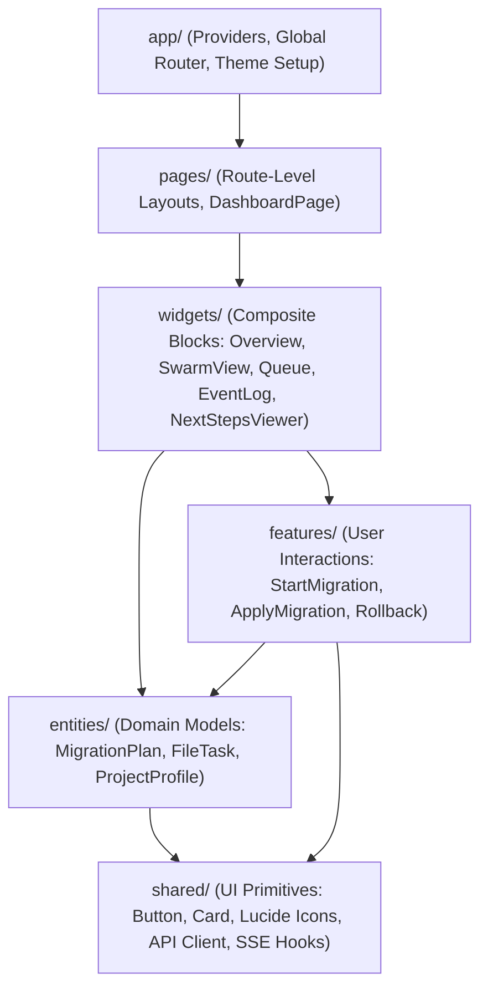

# Dashboard Architecture & Real-Time Telemetry — FSD & SSE

The **Metamorph Web Dashboard** (`apps/dashboard`) is the real-time visual control room of the migration swarm. Built with **React 18/19**, **Vite**, and **Tailwind CSS**, it implements **Feature-Sliced Design (FSD)** and real-time **Server-Sent Events (SSE)** telemetry while strictly adhering to a **Zero-Emoji Policy**.

---

## 1. Feature-Sliced Design (FSD) Architectural Flow

The dashboard maintains clean separation of concerns by following the strict FSD dependency hierarchy:

### Strict FSD Dependency Rule:
- Upper layers may import from lower layers.
- Cross-imports within the same layer are strictly prohibited.
- `shared/` contains zero domain-specific knowledge.

---

## 2. Real-Time Telemetry via Server-Sent Events (SSE)

Rather than polling the Express backend API, the dashboard maintains an open SSE connection to `/api/events`:
- **Low-Latency Streaming**: Each semantic event published on the Mozaik bus (`migration.started`, `file.discovered`, `file.migrated`, `file.reviewed`, `phase.integration_started`, `system.log`) is immediately streamed to connected browsers.
- **Graceful Reconnection**: The custom `useEventStream` hook handles connection drops with exponential backoff and transparently synchronizes stale state upon reconnection.
- **High-Frequency Event Throttling**: Batching updates prevents UI lag during bursts of file discovery.

---

## 3. Strict Zero-Emoji Design Invariant

Metamorph enforces a strict enterprise design language:
- **No Unicode Emojis**: Emojis (e.g. 🚀, 📦, ❌) are strictly forbidden in components, buttons, tooltips, and badges.
- **Vector Iconography**: All visual metaphors rely exclusively on `lucide-react` vector icons:
  - Monorepo package selector: `<Boxes size={16} />`
  - Architecture and routing indicators: `<Layers size={14} />`, `<Cpu size={14} />`, `<Code2 size={14} />`
  - Status badges: `<CheckCircle2 size={14} />`, `<AlertTriangle size={14} />`, `<XCircle size={14} />`
  - Close and dismiss actions: `<X size={14} />`

---

## 4. Dynamic Package Manager Next Steps

The `NextStepsViewer` widget renders copy-pasteable terminal instructions dynamically adapted to `plan.packageManager`:
- If `pnpm` was detected: shows `cd project && pnpm run dev` and `pnpm run build`.
- If `yarn` was detected: shows `yarn build` and `yarn test`.
- Eliminates hardcoded npm assumptions across all frontend widgets.
