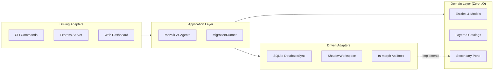

# Clean Code & Modularity Standards

This document establishes the engineering guidelines, design patterns, and modularity principles enforced across the Metamorph monorepo.

---

## 1. Hexagonal Boundary Integrity

Metamorph adheres to strict Ports and Adapters (Hexagonal Architecture):

### Invariant Rules:
1. **Zero I/O in `@nikelyh/domain`**: Absolutely no imports of `node:fs`, `node:sqlite`, `express`, or `@mozaik-ai/core`.
2. **Ports Before Implementations**: Application logic depends strictly on domain port interfaces (`StateRepository`, `MigrationCommand`), never on concrete classes like `SQLiteStateStore`.
3. **Primary Adapters Never Bypass Application**: The CLI and Dashboard must never directly interact with AST tools or write directly to `.metamorph/history.db`.

---

## 2. SOLID Design Principles

### Single Responsibility (SRP)
- Each agent handles a single event category.
- Detection logic is decoupled into `WorkspaceResolver`, `ManifestInspector`, `StructureInspector`, and `SubsumptionEngine`.
- Function length must remain under 35–50 lines; extract utility algorithms into pure helper modules.

### Open/Closed (OCP)
- New framework targets are added by providing new catalog packs, not by modifying the core migration runner.
- Polymorphic package managers are supported via pure command strategy maps (`resolvePackageManagerCommands`).

### Liskov Substitution (LSP)
- Implementations of secondary ports must be 100% interchangeable with in-memory mock repositories in unit test suites.

### Interface Segregation (ISP)
- Avoid giant context interfaces. Prefer discrete, typed data structures (`PackageManifest`, `ProjectProfile`, `PackageManagerCommands`).

### Dependency Inversion (DIP)
- High-level orchestration relies on abstract semantic events (`SemanticEventName`), never on concrete subagent instance IDs.

---

## 3. TypeScript Best Practices (Zero `any`)

- **Prohibition of `any`**: The use of `any` is strictly banned. Use strong interfaces, `unknown` with type guards (`isError`), or generics.
- **Literal Preservations with `satisfies`**: Use the `satisfies` operator on catalog definitions and rule arrays to preserve exact literal types.
- **Discriminated Unions**: State tasks and semantic event payloads must use discriminant properties (`status: 'pending' | 'in_progress' | 'completed' | 'failed'`).
- **Elimination of Magic Strings**: Always use typed enums and constants (`SemanticEventName`, `PackageManagerType`, `MigrationPhase`).
