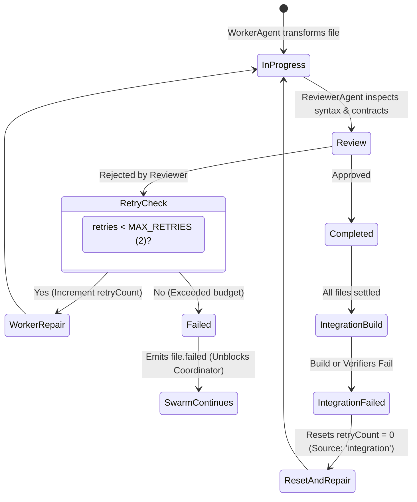

# Error Handling & Resilience Architecture

This document outlines the failure modes, retry policies, and resilience strategies implemented across the Metamorph swarm and infrastructure layers.

---

## 1. Resilience Invariants

Metamorph is engineered to survive partial failures without crashing or leaving workspaces in corrupted states:
1. **Host Isolation**: Even if a fatal build exception occurs, the user's host repository is never touched.
2. **Deterministic Bounded Retries**: Failed file tasks do not loop infinitely; they are capped by strict retry budgets.
3. **Idempotent Storage Updates**: Database writes to `.metamorph/history.db` use transactional boundaries and safe auto-migrations.

---

## 2. Retry Budget & Circuit Breaking

### Key Rules:
- **`MAX_RETRIES = 2`**: Standard reviewer rejections cap at 2 attempts.
- **Integration Reset**: When a rejection is triggered by `IntegrationAgent` (due to shadow compile or link errors), `retryCount` is reset to 0, allowing the swarm to collectively repair dependencies.

---

## 3. Subprocess Resilience & Timeout Handling

All child process invocations (`cleanInstall`, `runBuild`, `runTest`) in `packages/@nikelyh/infrastructure/src/tools/BuildTools.ts` must enforce:
- **Strict Timeouts**: Default 120s for package installation, 180s for build compilation.
- **Buffer Limits**: `maxBuffer` capped at 10MB with stream truncation to prevent Node.js Out-Of-Memory (OOM) crashes.
- **Explicit Working Directory**: Always locked to the active `.metamorph/shadow/<runId>`.

---

## 4. SQLite Persistence Resilience

`SQLiteStateStore` uses Node.js native `DatabaseSync` (`node:sqlite`):
- **Safe Auto-Migrations**: Schema changes execute within `try/catch` wrappers checking for duplicate column errors.
- **Zero Heavy Native Drivers**: Eliminates binary compilation headaches associated with `better-sqlite3`.
- **Prepared Statements**: All queries use parameterized inputs to prevent injection and maximize query plan caching.
