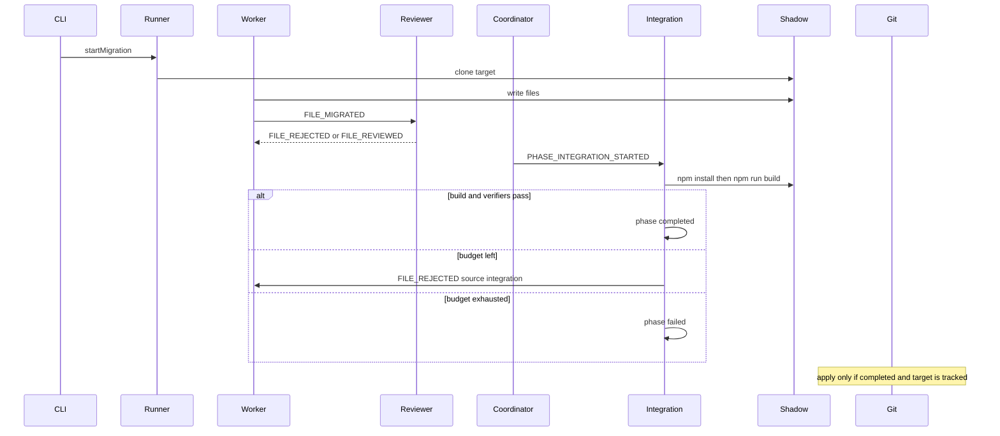

# Plan de fiabilidad de Metamorph

Este plan no añade frameworks, agentes ni paralelismo. Endurece el contrato que el README ya promete: el árbol original intacto, el swarm trabajando solo en shadow, y `apply` en una branch git que **versiona el target**.

Fuera de alcance: catálogo nuevo, más workers, dashboard de marketing, publicación npm, playgrounds dentro de `scratch/` como caso de producto.

## Invariantes (definición de listo)

Un run es **exitoso** solo si se cumplen todas:

1. El código original del usuario no se escribe hasta `metamorph apply` / `POST /api/migrations/apply`.
2. Toda mutación de archivos ocurre bajo `.metamorph/shadow/<runId>/`.
3. `phase === 'completed'` implica `npm install` **y** `npm run build` OK en ese shadow, **y** `collectShadowIssues` vacío.
4. `phase === 'failed'` es un resultado de primera clase (no disfrazado de completed). Apply está bloqueado.
5. Apply exige un git root que **no ignore** el target. Nunca `git init` anidado. Nunca `checkout -B` en el repo de Metamorph por un sandbox gitignored.
6. El binario que el usuario ejecuta (`metamorph` en PATH) coincide con el source que se acaba de cambiar, o el CLI avisa que está stale.

Hoy esos invariantes se rompen en puntos concretos.

## Diagnóstico anclado al código

**Mentira del proceso.** [packages/@nikelyh/cli/src/index.ts](packages/@nikelyh/cli/src/index.ts) despacha el swarm y a los 20s imprime `Migration simulation finished` y hace `process.exit(0)`. Mata agentes a mitad de `npm install`. El camino real es `metamorph ui`; `run` es un pie falso.

**Reset destructivo.** [MigrationRunner.startMigration](packages/@nikelyh/application/src/MigrationRunner.ts) llama `store.reset()` en cada run. Borra historial y planes concurrentes. Un segundo run desde el dashboard mata el primero.

**Tools al directorio padre.** CLI/UI registran `createRunBuildTool('.metamorph/shadow')`, no el `runId`. Integration sí rebinda al run. Un Worker que llame `run_project_build` buildea el padre, no el shadow del run. [assertSandbox](packages/@nikelyh/infrastructure/src/tools/AstTools.ts) usa `startsWith` sin separador de path.

**Worker emite FILE_MIGRATED aunque el archivo no exista** ([WorkerAgent.ts](packages/@nikelyh/application/src/agents/WorkerAgent.ts) ~105–121). El Reviewer **auto-aprueba deletes** salvo dos heurísticas Next ([ReviewerAgent.ts](packages/@nikelyh/application/src/agents/ReviewerAgent.ts) ~219–226). Eso es el camino `vite.config.ts` / `TasksPage.tsx` → integración con árbol hueco.

**npm install fallido no aborta.** [IntegrationAgent.ts](packages/@nikelyh/application/src/agents/IntegrationAgent.ts) continúa a `npm run build` si install falla. Build sin `node_modules` es ruido; el LLM repara a ciegas.

**Timeouts incoherentes.** Worker/Reviewer: 45s. Repair Integration: 120s. `runInShadowWorkspace`: 5 min. `npm install` real suele superar 45s. Coordinator watchdog 8s está bien; el timeout de inferencia no.

**Apply inseguro de producto.** [MigrationIntegrator](packages/@nikelyh/infrastructure/src/workspace/MigrationIntegrator.ts) ya rechaza targets gitignored y resuelve git root. La API **no comprueba** `phase === 'completed'` antes de apply. `checkout -B` sigue mutando HEAD del repo del usuario (esperado en un repo real; catastrófico si el pre-check de ignore falla). `scratch/` está en [.gitignore](.gitignore): playgrounds dentro de Metamorph **nunca** son el caso de apply.

**Completed vs failed en el bus.** `failMigration` emite `MIGRATION_COMPLETED`. El dashboard y el Reporter pueden pintar éxito. Falta un evento o payload `outcome`.

**Stale dist.** `metamorph` ejecuta [packages/@nikelyh/cli/dist](packages/@nikelyh/cli/dist) (tsup bundlea application+infrastructure). `npm run dev` usa tsx. Turbo no fuerza dashboard → CLI copy. Plugin `node:sqlite` es un parche post-build frágil.

**Cero tests.** `turbo.json` declara `test` pero no hay harness. Los verificadores ([registry.ts](packages/@nikelyh/application/src/migration/registry.ts), [NextMigrationHints.ts](packages/@nikelyh/application/src/utils/NextMigrationHints.ts), [planReady.ts](packages/@nikelyh/application/src/agents/planReady.ts), parseImplicatedFiles, isIgnoredByGit) son deterministas y se pueden testear **sin LLM**.

---

## Fase 0 — Contrato de estado (dominio)

Objetivo: una máquina de fases que el dashboard, apply y el swarm lean igual.

En [MigrationPlan.ts](packages/@nikelyh/domain/src/entities/MigrationPlan.ts):

- `phase`: `mapping | files | integration | completed | failed` (mapping opcional si Mapper ya existe).
- `outcome?: 'success' | 'failed'` solo cuando la fase es terminal.
- Persistir en [SQLiteStateStore](packages/@nikelyh/infrastructure/src/db/SQLiteStateStore.ts).

Eventos: o bien `MIGRATION_COMPLETED` con `outcome` en el payload, o un `MIGRATION_FAILED` distinto. Elegir **payload con outcome** para no romper listeners; actualizar Reporter y dashboard para no tratar failed como éxito.

`planReadyForIntegration` ya existe: tests de tabla (packages pending, files in_progress, all terminal, already integration). No emitir integración si `phase` es terminal.

`startMigration` **no** debe `reset()` la DB. Cleanup de shadows: no borrar el run en curso; `cleanupOldRuns` solo de runs no applied y más viejos que N. Reset queda como comando explícito.

---

## Fase 1 — Honestidad del CLI y del binario

1. `metamorph run` **espera** `phase` terminal (poll del store o evento), exit 0 solo si `outcome === 'success'`, exit 1 si failed/timeout de presupuesto global (p.ej. 30 min, alineado al watchdog max). Quitar el sleep de 20s y el texto “simulation finished”.
2. Version del CLI: [package.json](packages/@nikelyh/cli/package.json) dice `2.1.0`, commander `.version('1.0.0')`. Una sola fuente.
3. Al arrancar `run`/`ui`, loguear cwd, ruta de `dist`/`import.meta.url`, y advertir si `METAMORPH_DEV=1` no está y se espera source.
4. Script de desarrollo documentado: `npm run dev` en CLI (tsx) **o** `turbo build` + el binario. Turbo: `cli#build` `dependsOn` `dashboard#build`. Fallar el build del CLI si no hay `apps/dashboard/dist` (hoy solo `console.log` warning).
5. Conservar el plugin `node:sqlite`; añadir un test de build o grep en CI: ningún `from "sqlite"` en `cli/dist/*.js`.

---

## Fase 2 — Contrato del swarm (calidad del código migrado)

Orden de implementación: Reviewer → Worker → Integration. Sin esto, el build en shadow llega tarde.

**Reviewer.** Dejar de auto-aprobar “archivo no está en disco”. Política:

- Delete válido solo si hay **reemplazo demostrable** (plugin: p.ej. `vite.config.ts` ausente y existe `next.config.*`; `src/pages/X` movido a `src/views/X` o importado desde `src/app`).
- Si no hay reemplazo: `FILE_REJECTED` (repairable) o `FILE_FAILED` si el Worker ya indicó delete intencional sin sucesor.
- Quitar handlers DEBUG (`WhenAnythingHappens`, logs por cada evento). Ruido que oculta fallos reales.
- Timeout de review: 45s es corto para structured output; subir a ~120s o cancelar `runLoop` de verdad (hoy fire-and-forget + setTimeout).

**Worker.** No emitir `FILE_MIGRATED` si el path no existe **salvo** que el prompt/tools hayan creado un sucesor registrado (rename/delete tool que actualice la task). Si el archivo desapareció: emitir `FILE_MIGRATED` con `diff` vacío **y** un flag, o un evento `FILE_REMOVED` que el Reviewer/plugin valide. Hoy el Reviewer asume “delete intencional”.

Rebind de tools al **shadow del run** cuando llega `MIGRATION_STARTED` (o crear tools por run en el runner). Sandbox: `resolved === sandbox || resolved.startsWith(sandbox + sep)`.

**Integration.**

- Si `npm install` falla: no continuar a build. Requeue `package.json` / lockfile o `failMigration` si lastRound.
- No marcar completed si `!install.ok`.
- Repair LLM opcional; el rebuild determinista ya es la fuente de verdad (mantener). Cerrar el `runLoop` de repair en vez de solo `leave` + timeout (evitar agentes huérfanos y doble write).
- `parseImplicatedFiles` no debe ignorar paths que **aún no existen** (el caso `../App` / `page.tsx` que importa un archivo borrado). Hoy `existsSync` descarta justamente los rotos. Incluir paths implicados aunque falten en disco, si están bajo el shadow.

**Coordinator.** Ya es el sitio correcto para disparar integración. Asegurar que `FILE_REJECTED` de Integration pone tasks en `pending` (ya lo hace `requeueBrokenFiles`) y que el watchdog no reentra si `integrationLocks` está activo (revisar [CoordinatorAgent.ts](packages/@nikelyh/application/src/agents/CoordinatorAgent.ts) resto del archivo).

---

## Fase 3 — Apply seguro

En [api.ts](packages/@nikelyh/infrastructure/src/server/api.ts) y CLI `apply`:

- Rechazar si el plan no está `completed` / `outcome === 'success'`.
- Rechazar si `appliedAt` ya existe (idempotencia).
- Mantener `resolveGitRoot` + `isIgnoredByGit`.
- Extra: si `gitRoot` es el repo de Metamorph y el target cae bajo `scratch/`, error explícito de “sandbox de desarrollo, no apliques aquí” (defensa además de gitignore).
- `checkout -B` es correcto **solo** en el repo del usuario. Documentar que apply cambia HEAD; no hacer stash mágico en v1 de fiabilidad, pero fallar si el working tree del **target relativo** está dirty de forma que el copy pise trabajo no relacionado (opcional: `git status --porcelain -- <addPath>`).
- No append silencioso de `.gitignore` del usuario (`ensureApplyGitignore`) sin `SYSTEM_LOG` / mención en MIGRATION.md: es mutación extra. O quitarlo, o hacerlo opt-in.

Rollback: borrar shadow + no tocar git si no se aplicó. Si ya se aplicó, rollback de fiabilidad v1 = mensaje “reset the branch yourself”; no `git checkout` automático al default branch (demasiado destructivo).

---

## Fase 4 — Presupuestos y baches de rendimiento/uso

No es “escalar”. Es evitar runs infinitos y discos llenos.

| Presupuesto | Valor propuesto | Dónde |
|---|---|---|
| Worker retries (reviewer) | 2 (ya existe) | retryCounts |
| Integration retries extra | reset al rechazar desde integration (ya existe) | WorkerAgent |
| Rondas integración | 4 (ya existe) | IntegrationAgent |
| Inferencia worker/reviewer | 120s, cancelar loop | Worker/Reviewer |
| npm install+build | 5 min (ya existe), heartbeats 15s (ya existen) | BuildTools |
| Run global | 30 min | Coordinator watchdog max |
| Shadows en disco | keep 3 no-aplicados | ShadowWorkspace |
| Concurrencia | 3 workers / 3 reviewers (dejar) | colas locales |

Más:

- `NPM_CONFIG_WORKSPACES=false` ya está; verificar que el cwd es **siempre** el run dir.
- `startMigration` no clonar `node_modules` (ya se ignora). No copiar `.env` al shadow si contiene secretos del usuario… o sí copiarlo porque el build lo necesita: **copiar `.env` / `.env.example`**, nunca commitearlos en apply (gitignore). Hoy COPY_IGNORED no incluye `.env`; apply podría commitear secretos. Añadir `.env*` a COPY_IGNORED en apply (el shadow puede tenerlos para build).
- Dashboard poll 1s está bien para fiabilidad local; no SSE en este plan.

---

## Fase 5 — Verdad en UI

- Barras / swarm / queue leen `phase` y `outcome`, no solo tasks terminales (tasks terminales + integration en curso ya se intentó; auditar [DashboardPage.tsx](apps/dashboard/src/pages/dashboard/ui/DashboardPage.tsx) y [MigrationQueue.tsx](apps/dashboard/src/widgets/queue/MigrationQueue.tsx)).
- Apply deshabilitado si `phase !== 'completed'` o `appliedAt` set.
- Modal Integration Successful: no recortar (trabajo previo); verificar que no se dispara en `failed`.
- Eventos `system.log` de install/build deben aparecer en el log (ya se emiten).

Rebuild dashboard **y** copy a `cli/dist/public` en el mismo `turbo build`.

---

## Fase 6 — Harness de regresión (sin LLM en el camino feliz de CI)

Añadir Vitest (o node:test) en `packages/@nikelyh/application` e `infrastructure`. Turbo `test` sin `dependsOn: build` para unit tests.

**Tests unitarios (CI siempre):**

- `planReadyForIntegration` — tabla de fases/tasks.
- `collectRepairTargets` / `collectShadowIssues` con un shadow fixture mínimo en disco (temp dir).
- `analyzeReactToNextStructure`: fixture con `page.tsx` importando `../App` ausente **debe** producir issue.
- `parseImplicatedFiles`: incluir path faltante bajo shadow.
- `MigrationIntegrator.isIgnoredByGit` y `resolveGitRoot` con repo temp (init en tmp, no el repo de Metamorph).
- `assertSandbox` — path sibling no permitido.
- Reviewer policy extraída a función pura `classifyMissingFile(...)` para no montar Mozaik.

**Test de contrato CLI:** tras `tsup`, grep `node:sqlite`; version commander === package.json.

**Test e2e opcional / nightly:** un playground **fuera** del repo (tmp git repo) React→Next con `METAMORPH_MODEL` mockeado no es realista. En su lugar: inyectar un IntegrationAgent con `runInShadowWorkspace` real sobre un fixture **ya migrado mal** (el `../App`) y afirmar `phase === 'failed'` o requeue de `page.tsx`. Cero llamadas LLM.

Playgrounds en `scratch/` solo para demos humanas; el plan no los trata como producto.

---

## Fase 7 — Orden de entrega (PRs pequeños)

1. Dominio + persistencia de `outcome` + no reset en start + tests de `planReady`.
2. CLI `run` espera terminal; version; turbo dashboard→cli; sqlite grep.
3. `classifyMissingFile` + Reviewer/Worker; parseImplicatedFiles; tools por run + sandbox.
4. Integration: install fail = fail/requeue; apply gated por outcome; `.env` no en git add.
5. Dashboard gated + copy en build.
6. Harness de fixture shadow (App Router roto).

Cada PR debe poder correrse con `npm test` del paquete tocado. No mezclar catálogo frontend nuevo.

---

## Criterio de aceptación (manual, una vez)

En un **repo git temporal aparte** (no `scratch/` dentro de Metamorph):

1. `metamorph ui` sirve el dashboard actual (no un dist de hace horas).
2. Run React→Next: Integration corre `npm install`/`build` en shadow.
3. Si el build falla, el run no se pone successful; Apply está disabled.
4. Si el build pasa y verifiers limpian: Apply crea `metamorph/<runId>` **en ese repo**, HEAD del repo Metamorph no cambia.
5. `metamorph run` no sale a los 20s con éxito falso.
